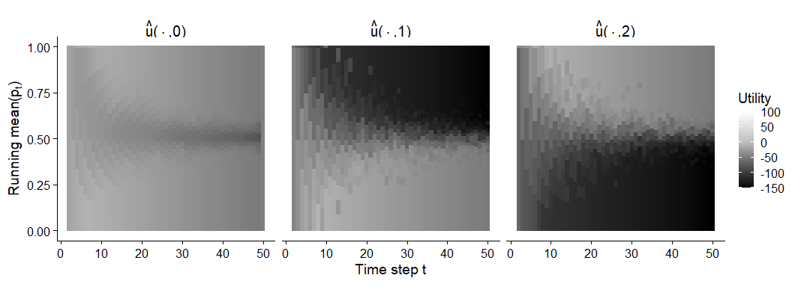
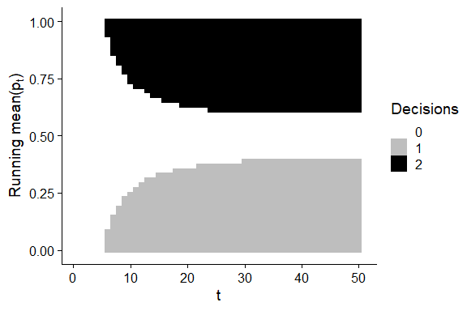
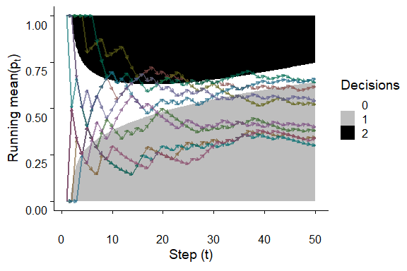

```r
library(tidyverse)
library(cowplot)
library(latex2exp)

# next two are for python to read .npz files
library(reticulate)
np = import("numpy")

qlims = c(-150, 100)

logdir = "../logs_q/seed_123456"
Qdf = read_csv(sprintf("%s/best_Q.csv", logdir)) %>% 
  select(-X1)
```


```r
Q = Qdf %>% 
  pivot_longer(cols=c("Q0", "Q1", "Q2"), names_to="D", values_to="Q") %>% 
  mutate(D=as.integer(str_sub(D, start=2))) %>% 
  mutate(Q = pmin(pmax(100 * Q, qlims[1]), qlims[2]))
head(Q)
```

```
## # A tibble: 6 x 4
##       t  phat     D     Q
##   <dbl> <dbl> <int> <dbl>
## 1     1     0     0 -23.1
## 2     1     0     1 -42.7
## 3     1     0     2 -61.9
## 4     2     0     0 -21.9
## 5     2     0     1 -38.2
## 6     2     0     2 -71.2
```

Plot the state-action value function.


```r
brks = c(qlims[1], 0, qlims[2])

ggplot(Q) +
  geom_tile(aes(x=t, y=phat, fill=Q)) +
  facet_wrap(~ D, ncol=3) +
  theme_cowplot() +
  scale_fill_gradientn(limits = qlims, colors=c("black", "grey", "white"))
```

<!-- -->

```r
ggsave("figs/ex1_qvals.png", width=10, height=4, units="in")
```

Same as above but save them all separately.


```r
brks = c(qlims[1], 0, qlims[2])

for (v in c(0, 1, 2)) {
  p = filter(Q, D==v) %>% 
    ggplot() +
      geom_tile(aes(x=t, y=phat, fill=Q)) +
      theme_cowplot() +
      scale_fill_gradientn(limits = qlims, colors=c("black", "grey", "white")) +
      labs(fill=sprintf("d=%s", v))
  fname = sprintf("figs/ex1_qvals_%s.png", v)
  ggsave(fname, plot=p, height=5, width=6, units="in")
}
```

Now plot the decision boundaries


```r
mat = Qdf[ c("Q0", "Q1", "Q2")] %>% 
  data.matrix
act = apply(mat, 1, which.max)
Qdec = Qdf %>% 
  mutate(dec=act - 1)

ggplot(Qdec) +
  geom_tile(aes(x=t, y=phat, fill=factor(dec))) + 
  scale_fill_manual(values=c("white", "grey", "black")) +
  theme_cowplot() +
  labs(fill="Decisions", y=TeX("Running mean (p_t)"))
```

<!-- -->

```r
ggsave("figs/ex1_boundaries.png", height=5, width=6, units="in")
```

Historical rewards


```r
evals = np$load(
  sprintf("%s/evaluations.npz", logdir), allow_pickle = TRUE
)
results = 100 * evals$get("results")
evaldf = tibble(
  timesteps = evals$get("timesteps"),
  mu = apply(results, 1, mean),
  sig = apply(results, 1, sd)
)
maxr = max(evaldf$mu)

ggplot(evaldf) +
  geom_line(aes(x=timesteps, y=mu)) +
  geom_ribbon(
    aes(x=timesteps, ymin=mu - sig, ymax=mu + sig),
    alpha=0.25
  ) +
  geom_hline(aes(yintercept=maxr), lty=2) +
  # geom_text(aes(0, maxr, label = maxr, vjust = -1, hjust=-0.5)) +
  theme_cowplot() +
  labs(x="Simulation steps", y=TeX("Evaluation episode total rewards (G_0)"))
```

<!-- -->

```r
ggsave("figs/ex1_returns.png", width=6.5, height=4.5, units="in")
```

The maximum mean reward over 1000 eval episodes is


```r
maxr
```

```
## [1] -29.159
```

